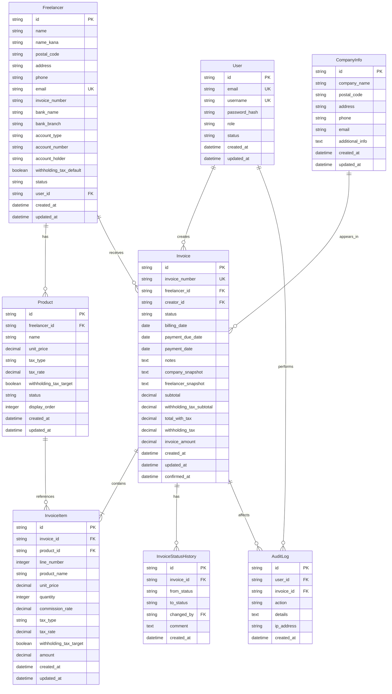

# 02. データベース設計

## 2.1 ER図

---

## 2.2 テーブル定義

### 2.2.1 User（ユーザー）

自社ユーザーとフリーランスの認証情報を管理

| カラム名 | データ型 | NULL | デフォルト | 説明 |
|---------|---------|------|-----------|------|
| id | VARCHAR(36) | NOT NULL | UUID | 主キー |
| email | VARCHAR(255) | NOT NULL | - | メールアドレス（ログインID） |
| username | VARCHAR(100) | NOT NULL | - | ユーザー名（ログインID） |
| password_hash | VARCHAR(255) | NOT NULL | - | bcryptハッシュ化パスワード |
| role | VARCHAR(20) | NOT NULL | - | ロール（COMPANY, FREELANCER） |
| status | VARCHAR(20) | NOT NULL | ACTIVE | ステータス（ACTIVE, INACTIVE, PENDING） |
| created_at | TIMESTAMP | NOT NULL | CURRENT_TIMESTAMP | 作成日時 |
| updated_at | TIMESTAMP | NOT NULL | CURRENT_TIMESTAMP | 更新日時 |

**制約**
- PRIMARY KEY: id
- UNIQUE: email
- UNIQUE: username
- INDEX: email, role, status

**備考**
- PENDING: 招待済み・初回ログイン前
- ACTIVE: 有効
- INACTIVE: 無効

---

### 2.2.2 Freelancer（フリーランス）

フリーランスの詳細情報を管理

| カラム名 | データ型 | NULL | デフォルト | 説明 |
|---------|---------|------|-----------|------|
| id | VARCHAR(36) | NOT NULL | UUID | 主キー |
| name | VARCHAR(200) | NOT NULL | - | 氏名または屋号 |
| name_kana | VARCHAR(200) | NULL | - | 氏名カナ |
| postal_code | VARCHAR(10) | NULL | - | 郵便番号 |
| address | TEXT | NULL | - | 住所 |
| phone | VARCHAR(20) | NULL | - | 電話番号 |
| email | VARCHAR(255) | NOT NULL | - | メールアドレス |
| invoice_number | VARCHAR(20) | NULL | - | 適格請求書発行事業者登録番号 |
| bank_name | VARCHAR(100) | NULL | - | 銀行名 |
| bank_branch | VARCHAR(100) | NULL | - | 支店名 |
| account_type | VARCHAR(20) | NULL | - | 口座種別（ORDINARY, CURRENT, SAVINGS） |
| account_number | VARCHAR(20) | NULL | - | 口座番号 |
| account_holder | VARCHAR(200) | NULL | - | 口座名義 |
| withholding_tax_default | BOOLEAN | NOT NULL | TRUE | 源泉税対象デフォルト |
| status | VARCHAR(20) | NOT NULL | ACTIVE | ステータス（ACTIVE, INACTIVE） |
| user_id | VARCHAR(36) | NULL | - | 紐づくユーザーID（外部キー） |
| created_at | TIMESTAMP | NOT NULL | CURRENT_TIMESTAMP | 作成日時 |
| updated_at | TIMESTAMP | NOT NULL | CURRENT_TIMESTAMP | 更新日時 |

**制約**
- PRIMARY KEY: id
- FOREIGN KEY: user_id → User(id)
- UNIQUE: email
- INDEX: status, email

**備考**
- user_idはフリーランス本人がログインする場合に設定
- 口座種別: ORDINARY（普通）、CURRENT（当座）、SAVINGS（貯蓄）

---

### 2.2.3 Product（商品マスタ）

フリーランスごとの商品・作業情報を管理

| カラム名 | データ型 | NULL | デフォルト | 説明 |
|---------|---------|------|-----------|------|
| id | VARCHAR(36) | NOT NULL | UUID | 主キー |
| freelancer_id | VARCHAR(36) | NOT NULL | - | フリーランスID（外部キー） |
| name | VARCHAR(200) | NOT NULL | - | 商品名・作業名 |
| unit_price | DECIMAL(12,2) | NOT NULL | - | 単価 |
| tax_type | VARCHAR(20) | NOT NULL | EXCLUSIVE | 消費税（INCLUSIVE, EXCLUSIVE） |
| tax_rate | DECIMAL(4,2) | NOT NULL | 10.00 | 消費税率（%） |
| withholding_tax_target | BOOLEAN | NOT NULL | TRUE | 源泉税対象 |
| status | VARCHAR(20) | NOT NULL | ACTIVE | ステータス（ACTIVE, INACTIVE） |
| display_order | INTEGER | NOT NULL | 0 | 表示順序 |
| created_at | TIMESTAMP | NOT NULL | CURRENT_TIMESTAMP | 作成日時 |
| updated_at | TIMESTAMP | NOT NULL | CURRENT_TIMESTAMP | 更新日時 |

**制約**
- PRIMARY KEY: id
- FOREIGN KEY: freelancer_id → Freelancer(id)
- INDEX: freelancer_id, status, display_order

**備考**
- tax_type: INCLUSIVE（税込）、EXCLUSIVE（税別）
- display_orderは請求書作成時の明細表示順序

---

### 2.2.4 Invoice（請求書）

請求書のヘッダー情報を管理

| カラム名 | データ型 | NULL | デフォルト | 説明 |
|---------|---------|------|-----------|------|
| id | VARCHAR(36) | NOT NULL | UUID | 主キー |
| invoice_number | VARCHAR(20) | NULL | - | 請求書番号（YYYYMM-XXXX） |
| freelancer_id | VARCHAR(36) | NOT NULL | - | フリーランスID（外部キー） |
| creator_id | VARCHAR(36) | NOT NULL | - | 作成者ID（外部キー） |
| status | VARCHAR(20) | NOT NULL | DRAFT | ステータス |
| billing_date | DATE | NOT NULL | - | 請求締日 |
| payment_due_date | DATE | NOT NULL | - | 支払予定日 |
| payment_date | DATE | NULL | - | 実支払日 |
| notes | TEXT | NULL | - | 備考 |
| company_snapshot | TEXT | NULL | - | 自社情報スナップショット（JSON） |
| freelancer_snapshot | TEXT | NULL | - | フリーランス情報スナップショット（JSON） |
| subtotal | DECIMAL(12,2) | NOT NULL | 0 | 小計（税別） |
| withholding_tax_subtotal | DECIMAL(12,2) | NOT NULL | 0 | 源泉税対象小計（税別） |
| total_with_tax | DECIMAL(12,2) | NOT NULL | 0 | 合計（税込） |
| withholding_tax | DECIMAL(12,2) | NOT NULL | 0 | 源泉所得税 |
| invoice_amount | DECIMAL(12,2) | NOT NULL | 0 | 請求額（税込） |
| created_at | TIMESTAMP | NOT NULL | CURRENT_TIMESTAMP | 作成日時 |
| updated_at | TIMESTAMP | NOT NULL | CURRENT_TIMESTAMP | 更新日時 |
| confirmed_at | TIMESTAMP | NULL | - | 確定日時 |

**制約**
- PRIMARY KEY: id
- FOREIGN KEY: freelancer_id → Freelancer(id)
- FOREIGN KEY: creator_id → User(id)
- UNIQUE: invoice_number（NULL許可）
- INDEX: invoice_number, freelancer_id, creator_id, status, billing_date, payment_due_date

**ステータス**
- DRAFT: 下書き
- PENDING_APPROVAL: 承認待ち
- REJECTED: 差し戻し
- APPROVED: 承認済
- PAID: 支払済

**備考**
- invoice_numberは確定時（PENDING_APPROVAL移行時）に採番
- スナップショットはJSON形式で保存（確定時に記録）

---

### 2.2.5 InvoiceItem（請求書明細）

請求書の明細行を管理

| カラム名 | データ型 | NULL | デフォルト | 説明 |
|---------|---------|------|-----------|------|
| id | VARCHAR(36) | NOT NULL | UUID | 主キー |
| invoice_id | VARCHAR(36) | NOT NULL | - | 請求書ID（外部キー） |
| product_id | VARCHAR(36) | NULL | - | 商品ID（外部キー、手動入力時はNULL） |
| line_number | INTEGER | NOT NULL | - | 行番号 |
| product_name | VARCHAR(200) | NOT NULL | - | 商品名・作業名 |
| unit_price | DECIMAL(12,2) | NOT NULL | - | 単価 |
| quantity | INTEGER | NOT NULL | 1 | 個数 |
| commission_rate | DECIMAL(5,2) | NOT NULL | 100.00 | 報酬率（%） |
| tax_type | VARCHAR(20) | NOT NULL | - | 消費税（INCLUSIVE, EXCLUSIVE） |
| tax_rate | DECIMAL(4,2) | NOT NULL | - | 消費税率（%） |
| withholding_tax_target | BOOLEAN | NOT NULL | - | 源泉税対象 |
| amount | DECIMAL(12,2) | NOT NULL | - | 金額（税別） |
| created_at | TIMESTAMP | NOT NULL | CURRENT_TIMESTAMP | 作成日時 |
| updated_at | TIMESTAMP | NOT NULL | CURRENT_TIMESTAMP | 更新日時 |

**制約**
- PRIMARY KEY: id
- FOREIGN KEY: invoice_id → Invoice(id) ON DELETE CASCADE
- FOREIGN KEY: product_id → Product(id) ON DELETE SET NULL
- INDEX: invoice_id, line_number

**備考**
- line_numberは表示順序（1から連番）
- amountは自動計算: unit_price × quantity × (commission_rate / 100)
- **amountは常に税別金額を格納**（tax_typeに関わらず）
- 税込金額は表示時に計算（tax_type='INCLUSIVE'の場合はamountをそのまま税込扱い）

---

### 2.2.6 InvoiceStatusHistory（請求書ステータス履歴）

請求書のステータス変更履歴を管理

| カラム名 | データ型 | NULL | デフォルト | 説明 |
|---------|---------|------|-----------|------|
| id | VARCHAR(36) | NOT NULL | UUID | 主キー |
| invoice_id | VARCHAR(36) | NOT NULL | - | 請求書ID（外部キー） |
| from_status | VARCHAR(20) | NULL | - | 変更前ステータス |
| to_status | VARCHAR(20) | NOT NULL | - | 変更後ステータス |
| changed_by | VARCHAR(36) | NOT NULL | - | 変更者ID（外部キー） |
| comment | TEXT | NULL | - | コメント（差し戻し理由など） |
| created_at | TIMESTAMP | NOT NULL | CURRENT_TIMESTAMP | 作成日時 |

**制約**
- PRIMARY KEY: id
- FOREIGN KEY: invoice_id → Invoice(id) ON DELETE CASCADE
- FOREIGN KEY: changed_by → User(id)
- INDEX: invoice_id, created_at

---

### 2.2.7 CompanyInfo（自社情報）

請求書に表示する自社情報を管理

| カラム名 | データ型 | NULL | デフォルト | 説明 |
|---------|---------|------|-----------|------|
| id | VARCHAR(36) | NOT NULL | UUID | 主キー |
| company_name | VARCHAR(200) | NOT NULL | - | 会社名 |
| postal_code | VARCHAR(10) | NULL | - | 郵便番号 |
| address | TEXT | NULL | - | 住所 |
| phone | VARCHAR(20) | NULL | - | 電話番号 |
| email | VARCHAR(255) | NULL | - | メールアドレス |
| additional_info | TEXT | NULL | - | その他情報 |
| created_at | TIMESTAMP | NOT NULL | CURRENT_TIMESTAMP | 作成日時 |
| updated_at | TIMESTAMP | NOT NULL | CURRENT_TIMESTAMP | 更新日時 |

**制約**
- PRIMARY KEY: id

**備考**
- 基本的に1レコードのみ運用
- 更新時は既存レコードを更新

---

### 2.2.8 AuditLog（監査ログ）

システム操作の監査ログを記録

| カラム名 | データ型 | NULL | デフォルト | 説明 |
|---------|---------|------|-----------|------|
| id | VARCHAR(36) | NOT NULL | UUID | 主キー |
| user_id | VARCHAR(36) | NULL | - | ユーザーID（外部キー） |
| invoice_id | VARCHAR(36) | NULL | - | 請求書ID（外部キー） |
| action | VARCHAR(50) | NOT NULL | - | アクション |
| details | TEXT | NULL | - | 詳細（JSON） |
| ip_address | VARCHAR(45) | NULL | - | IPアドレス |
| created_at | TIMESTAMP | NOT NULL | CURRENT_TIMESTAMP | 作成日時 |

**制約**
- PRIMARY KEY: id
- FOREIGN KEY: user_id → User(id) ON DELETE SET NULL
- FOREIGN KEY: invoice_id → Invoice(id) ON DELETE SET NULL
- INDEX: user_id, invoice_id, action, created_at

**アクション例**
- USER_LOGIN
- USER_LOGOUT
- INVOICE_CREATE
- INVOICE_UPDATE
- INVOICE_CONFIRM
- INVOICE_APPROVE
- INVOICE_REJECT
- INVOICE_PAID
- INVOICE_DELETE

---

## 2.3 リレーション

### 主要なリレーション

1. **User ← Invoice**
   - 1対多: 1人のユーザーが複数の請求書を作成

2. **Freelancer ← Invoice**
   - 1対多: 1人のフリーランスが複数の請求書を受け取る

3. **Freelancer ← Product**
   - 1対多: 1人のフリーランスが複数の商品を持つ

4. **Invoice ← InvoiceItem**
   - 1対多: 1つの請求書が複数の明細行を持つ

5. **Invoice ← InvoiceStatusHistory**
   - 1対多: 1つの請求書が複数のステータス履歴を持つ

6. **User ← Freelancer**
   - 1対1（任意）: フリーランスがログイン可能な場合、Userと紐づく

---

## 2.4 インデックス戦略

### パフォーマンス最適化のためのインデックス

1. **User**
   - email（ログイン高速化）
   - username（ログイン高速化）
   - role + status（ユーザー一覧フィルタ）

2. **Freelancer**
   - email（検索）
   - status（有効なフリーランス一覧）

3. **Product**
   - freelancer_id + status + display_order（請求書作成時の商品一覧）

4. **Invoice**
   - invoice_number（請求書検索）
   - freelancer_id + status（フリーランス別請求書一覧）
   - creator_id + status（作成者別請求書一覧）
   - billing_date（期間検索）
   - payment_due_date（支払予定日検索）
   - status + billing_date（ステータス別期間検索）

5. **InvoiceItem**
   - invoice_id + line_number（明細表示順序）

6. **InvoiceStatusHistory**
   - invoice_id + created_at（履歴表示）

7. **AuditLog**
   - user_id + created_at（ユーザー別ログ）
   - invoice_id + created_at（請求書別ログ）
   - action + created_at（アクション別ログ）

---

## 2.5 データ整合性

### 外部キー制約

- **ON DELETE CASCADE**: InvoiceItem, InvoiceStatusHistory
  - 請求書削除時に関連データも削除
  
- **ON DELETE SET NULL**: AuditLog
  - ユーザー削除時もログは保持（user_idをNULLに）

- **ON DELETE RESTRICT**: Invoice（freelancer_id, creator_id）
  - フリーランス・ユーザー削除時、関連請求書がある場合は削除不可

### トランザクション管理

以下の操作は必ずトランザクション内で実行:
- 請求書確定（Invoice更新 + InvoiceStatusHistory追加 + 請求書番号採番）
- 請求書削除（Invoice削除 + InvoiceItem削除 + InvoiceStatusHistory削除）
- 金額再計算（InvoiceItem更新 + Invoice集計更新）

---

## 次のドキュメント

- [03_画面設計.md](./03_画面設計.md)
