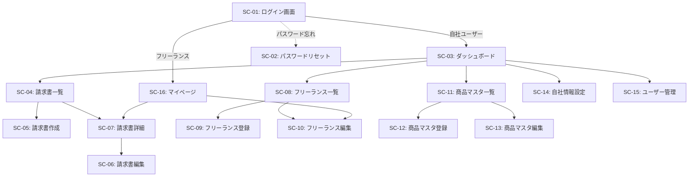

# 03. 画面設計

## 3.1 画面一覧

| 画面ID | 画面名 | URL | アクセス権限 | 説明 |
|--------|--------|-----|-------------|------|
| SC-01 | ログイン画面 | `/login` | 全員 | ログイン |
| SC-02 | パスワードリセット画面 | `/reset-password` | 全員 | パスワードリセット |
| SC-03 | ダッシュボード | `/` | 自社ユーザー | 請求書一覧・統計 |
| SC-04 | 請求書一覧 | `/invoices` | 自社ユーザー | 請求書の検索・一覧表示 |
| SC-05 | 請求書作成 | `/invoices/new` | 自社ユーザー | 新規請求書作成 |
| SC-06 | 請求書編集 | `/invoices/[id]/edit` | 自社ユーザー | 請求書編集 |
| SC-07 | 請求書詳細 | `/invoices/[id]` | 自社・フリーランス | 請求書詳細表示 |
| SC-08 | フリーランス一覧 | `/freelancers` | 自社ユーザー | フリーランス一覧 |
| SC-09 | フリーランス登録 | `/freelancers/new` | 自社ユーザー | 新規フリーランス登録 |
| SC-10 | フリーランス編集 | `/freelancers/[id]/edit` | 自社・フリーランス本人 | フリーランス情報編集 |
| SC-11 | 商品マスタ一覧 | `/products` | 自社ユーザー | 商品マスタ一覧 |
| SC-12 | 商品マスタ登録 | `/products/new` | 自社ユーザー | 新規商品登録 |
| SC-13 | 商品マスタ編集 | `/products/[id]/edit` | 自社ユーザー | 商品情報編集 |
| SC-14 | 自社情報設定 | `/settings/company` | 自社ユーザー | 自社情報編集 |
| SC-15 | ユーザー管理 | `/settings/users` | 自社ユーザー | 自社ユーザー管理 |
| SC-16 | マイページ | `/mypage` | フリーランス | フリーランス本人の情報・請求書一覧 |

---

## 3.2 画面遷移図



---

## 3.3 画面詳細仕様

### SC-01: ログイン画面

**URL**: `/login`

**アクセス権限**: 全員（未認証）

**表示項目**

| 項目名 | 入力/表示 | 必須 | バリデーション | 説明 |
|--------|----------|------|---------------|------|
| ユーザーID | 入力 | ○ | 1〜100文字 | emailまたはusername |
| パスワード | 入力 | ○ | 1〜100文字 | パスワード |
| ログイン状態を保持 | チェックボックス | - | - | 次回自動ログイン |

**ボタン・アクション**

- **ログインボタン**: 認証処理を実行
- **パスワードを忘れた方**: SC-02へ遷移

**初期表示**

- 前回ログインしたユーザーIDを記憶（Cookie）
- ログイン済みの場合、ダッシュボードまたはマイページへリダイレクト

**エラーメッセージ**

- 「ユーザーIDまたはパスワードが正しくありません」
- 「アカウントが無効化されています」

---

### SC-02: パスワードリセット画面

**URL**: `/reset-password`

**アクセス権限**: 全員（未認証）

**表示内容**

案内メッセージのみを表示（フォーム入力なし）

```
パスワードをお忘れの場合は、
スタッフまでお問い合わせください。
```

**ボタン・アクション**

- **ログイン画面に戻る**: SC-01へ遷移

**備考**

- MVP版ではパスワードリセット機能は実装しない
- スタッフが手動でパスワードをリセットする運用

---

### SC-03: ダッシュボード

**URL**: `/`

**アクセス権限**: 自社ユーザー

**表示項目**

| セクション | 表示内容 | 説明 |
|-----------|---------|------|
| サマリーカード | 今月の請求書件数 | ステータス別集計 |
| サマリーカード | 今月の請求額合計 | 承認済・支払済の合計 |
| サマリーカード | 支払予定件数 | 未払いの請求書件数 |
| 最近の請求書 | 最新5件の請求書 | 請求書番号、フリーランス名、金額、ステータス |
| クイックアクション | 新規請求書作成ボタン | SC-05へ遷移 |
| クイックアクション | フリーランス登録ボタン | SC-09へ遷移 |

**ボタン・アクション**

- **新規請求書作成**: SC-05へ遷移
- **請求書一覧を見る**: SC-04へ遷移
- **フリーランス一覧を見る**: SC-08へ遷移

**初期表示**

- ログイン後、自動的にダッシュボードを表示
- 当月のデータを集計して表示

---

### SC-04: 請求書一覧

**URL**: `/invoices`

**アクセス権限**: 自社ユーザー

**表示項目**

| 項目名 | 表示内容 | 説明 |
|--------|---------|------|
| 検索フォーム | ステータス、フリーランス名、作成者、作成日期間、請求締日期間、支払予定日期間 | フィルタ条件 |
| 一覧テーブル | 請求書番号、フリーランス名、請求締日、支払予定日、請求額、ステータス、作成者、作成日 | ソート可能 |

**ボタン・アクション**

- **新規作成**: SC-05へ遷移
- **詳細**: SC-07へ遷移
- **編集**: SC-06へ遷移（下書き・差し戻しのみ）
- **複製**: 同じ内容で新規請求書作成
- **削除**: 下書きのみ削除可能（確認ダイアログ表示）
- **PDF出力**: PDF生成・ダウンロード

**初期表示**

- 全ステータス、作成日降順で表示
- ページネーション: 20件/ページ

**ソート**

- 請求書番号、請求締日、支払予定日、請求額、作成日（昇順・降順）

**エラーメッセージ**

- 「削除できません。下書き以外の請求書は削除できません」
- 「編集できません。承認済・支払済の請求書は編集できません」

---

### SC-05: 請求書作成

**URL**: `/invoices/new?freelancerId=[id]`

**アクセス権限**: 自社ユーザー

**表示項目**

| セクション | 項目名 | 入力/表示 | 必須 | バリデーション | 説明 |
|-----------|--------|----------|------|---------------|------|
| 基本情報 | フリーランス選択 | 選択 | ○ | - | 有効なフリーランス一覧 |
| 基本情報 | 請求締日 | 日付入力 | ○ | 日付形式 | デフォルト: 前月末 |
| 基本情報 | 支払予定日 | 日付入力 | ○ | 日付形式 | デフォルト: 締日の翌月末 |
| お支払先情報 | 氏名、住所、電話番号、適格請求書発行事業者登録番号 | 表示 | - | - | フリーランス情報から自動入力 |
| 支払元情報 | 会社名、住所、電話番号 | 表示 | - | - | 自社情報から自動入力 |
| 明細テーブル | 商品名 | 入力 | ○ | 1〜200文字 | 商品マスタから自動入力（編集可） |
| 明細テーブル | 単価 | 入力 | ○ | 数値、0以上 | 商品マスタから自動入力（編集可） |
| 明細テーブル | 個数 | 入力 | ○ | 整数、1以上 | デフォルト: 1 |
| 明細テーブル | 報酬率(%) | 入力 | ○ | 0〜100、小数第1位まで | デフォルト: 100.0 |
| 明細テーブル | 消費税 | 選択 | ○ | 込/別 | 商品マスタから自動入力（編集可） |
| 明細テーブル | 消費税率 | 入力 | ○ | 0〜100、小数第1位まで | デフォルト: 10.0 |
| 明細テーブル | 源泉税対象 | チェックボックス | - | - | 商品マスタから自動入力（編集可） |
| 明細テーブル | 金額（税別） | 表示 | - | - | 自動計算（常に税別で表示） |
| 集計 | 小計（税別） | 表示 | - | - | 自動計算 |
| 集計 | 内、源泉税対象小計（税別） | 表示 | - | - | 自動計算 |
| 集計 | 合計（税込） | 表示 | - | - | 自動計算 |
| 集計 | 源泉所得税 | 表示 | - | - | 自動計算 |
| 集計 | 請求額（税込） | 表示 | - | - | 自動計算 |
| 備考 | 備考 | テキストエリア | - | 1000文字以内 | 自由入力 |

**ボタン・アクション**

- **明細行を追加**: 空行を追加
- **行を削除**: 選択した明細行を削除
- **下書き保存**: ステータス「下書き」で保存
- **確定**: ステータス「承認待ち」で保存、請求書番号採番、スナップショット保存、確定完了メッセージと連絡文テンプレート表示
- **キャンセル**: 確認ダイアログ後、SC-04へ遷移

**初期表示**

- フリーランス選択済みの場合、そのフリーランスの有効な商品を明細テーブルに自動表示
- 請求締日: 前月末
- 支払予定日: 締日の翌月末

**バリデーション**

- 明細が1行以上必要
- 金額が0円の明細は不可
- 請求締日 ≤ 支払予定日

**エラーメッセージ**

- 「明細を1行以上入力してください」
- 「支払予定日は請求締日以降の日付を指定してください」

**確定時の動作**

1. 請求書番号を採番（YYYYMM-XXXX形式）
2. 自社情報・フリーランス情報をスナップショット保存
3. ステータスを「承認待ち」に変更
4. 確定完了メッセージと連絡文テンプレートをモーダル表示

**連絡文テンプレート例**

```
【請求書確定のお知らせ】

{フリーランス名} 様

お世話になっております。
請求書を作成いたしましたので、ご確認をお願いいたします。

請求書番号: {請求書番号}
請求締日: {請求締日}
請求額: {請求額}円

以下のURLからログインしてご確認ください。
{ログインURL}

内容に問題がなければ「承認」を、修正が必要な場合は「差し戻し」をお願いいたします。

よろしくお願いいたします。
```

---

### SC-06: 請求書編集

**URL**: `/invoices/[id]/edit`

**アクセス権限**: 自社ユーザー

**表示項目**: SC-05と同様

**制約**

- 下書き、差し戻しのみ編集可能
- 承認待ち中の請求書を編集すると、ステータスが「下書き」に戻る

**ボタン・アクション**

- SC-05と同様

**初期表示**

- 既存の請求書データを表示

---

### SC-07: 請求書詳細

**URL**: `/invoices/[id]`

**アクセス権限**: 自社ユーザー、該当フリーランス

**表示項目**

| セクション | 項目名 | 表示内容 |
|-----------|--------|---------|
| ヘッダー | 請求書番号 | - |
| ヘッダー | ステータス | バッジ表示 |
| 基本情報 | 請求締日、支払予定日、実支払日 | - |
| お支払先情報 | 氏名、住所、電話番号、適格請求書発行事業者登録番号 | スナップショットから表示 |
| 支払元情報 | 会社名、住所、電話番号 | スナップショットから表示 |
| 明細テーブル | 商品名、単価、個数、報酬率、消費税、消費税率、源泉税対象、金額 | - |
| 集計 | 小計、源泉税対象小計、合計、源泉所得税、請求額 | - |
| 備考 | 備考 | - |
| 履歴 | ステータス変更履歴 | 日時、変更者、変更内容、コメント |

**ボタン・アクション（自社ユーザー）**

- **編集**: SC-06へ遷移（下書き・差し戻しのみ）
- **複製**: 同じ内容で新規請求書作成
- **削除**: 下書きのみ削除可能
- **PDF出力**: PDF生成・ダウンロード
- **支払済にする**: 実支払日入力モーダル表示、ステータスを「支払済」に変更

**ボタン・アクション（フリーランス）**

- **承認**: 確認ダイアログ後、ステータスを「承認済」に変更
- **差し戻し**: コメント入力モーダル表示、ステータスを「差し戻し」に変更
- **PDF出力**: PDF生成・ダウンロード

**初期表示**

- 請求書データを表示
- ステータス履歴を時系列で表示

**エラーメッセージ**

- 「この請求書にアクセスする権限がありません」

---

### SC-08: フリーランス一覧

**URL**: `/freelancers`

**アクセス権限**: 自社ユーザー

**表示項目**

| 項目名 | 表示内容 | 説明 |
|--------|---------|------|
| 検索フォーム | 氏名、メールアドレス、ステータス | フィルタ条件 |
| 一覧テーブル | 氏名、メールアドレス、電話番号、ステータス、登録日 | ソート可能 |

**ボタン・アクション**

- **新規登録**: SC-09へ遷移
- **詳細・編集**: SC-10へ遷移
- **商品マスタ管理**: SC-11へ遷移（フリーランスでフィルタ）
- **請求書作成**: SC-05へ遷移（フリーランス選択済み）

**初期表示**

- 全ステータス、登録日降順で表示
- ページネーション: 20件/ページ

---

### SC-09: フリーランス登録

**URL**: `/freelancers/new`

**アクセス権限**: 自社ユーザー

**表示項目**

| 項目名 | 入力/表示 | 必須 | バリデーション | 説明 |
|--------|----------|------|---------------|------|
| 氏名 | 入力 | ○ | 1〜200文字 | - |
| 氏名カナ | 入力 | - | 1〜200文字 | - |
| メールアドレス | 入力 | ○ | メール形式、重複不可 | - |
| 郵便番号 | 入力 | ○ | 7桁数字 | - |
| 住所 | テキストエリア | ○ | 500文字以内 | - |
| 電話番号 | 入力 | ○ | 20文字以内 | - |
| 適格請求書発行事業者登録番号 | 入力 | - | T + 数字13桁（例: T1234567890123） | - |
| 銀行名 | 入力 | ○ | 100文字以内 | - |
| 支店名 | 入力 | ○ | 100文字以内 | - |
| 口座種別 | 選択 | ○ | 普通/当座/貯蓄 | - |
| 口座番号 | 入力 | ○ | 20文字以内 | - |
| 口座名義 | 入力 | ○ | 200文字以内 | - |
| 源泉税対象デフォルト | チェックボックス | - | - | デフォルト: ON |
| ステータス | 選択 | ○ | 有効/無効 | デフォルト: 有効 |

**ボタン・アクション**

- **登録**: フリーランス登録、招待URL・ID・仮パスワード生成、連絡文テンプレート表示
- **キャンセル**: SC-08へ遷移

**初期表示**

- 空フォーム

**登録完了時の動作**

1. フリーランス情報をDBに保存
2. ユーザーアカウント作成（role: FREELANCER, status: PENDING）
3. 招待URL、ID、仮パスワードを生成
4. 連絡文テンプレートをモーダル表示

**連絡文テンプレート例**

```
【システム招待のご案内】

{フリーランス名} 様

お世話になっております。
請求書管理システムへのアクセス情報をお送りいたします。

以下のURLからログインし、パスワードを変更してください。
招待URL: {招待URL}
ユーザーID: {ユーザーID}
仮パスワード: {仮パスワード}

ログイン後、ご自身の詳細情報（住所、振込先等）を編集・補完してください。

よろしくお願いいたします。
```

---

### SC-10: フリーランス編集

**URL**: `/freelancers/[id]/edit`

**アクセス権限**: 自社ユーザー、フリーランス本人

**表示項目**: SC-09と同様

**ボタン・アクション**

- **更新**: フリーランス情報を更新
- **キャンセル**: SC-08へ遷移（自社ユーザー）、SC-16へ遷移（フリーランス）

**初期表示**

- 既存のフリーランスデータを表示

**制約**

- フリーランス本人は自分の情報のみ編集可能
- 自社ユーザーは全フリーランスの情報を編集可能

---

### SC-11: 商品マスタ一覧

**URL**: `/products?freelancerId=[id]`

**アクセス権限**: 自社ユーザー

**表示項目**

| 項目名 | 表示内容 | 説明 |
|--------|---------|------|
| 検索フォーム | フリーランス名、ステータス | フィルタ条件 |
| 一覧テーブル | フリーランス名、商品名、単価、消費税、源泉税対象、ステータス | ソート可能 |

**ボタン・アクション**

- **新規登録**: SC-12へ遷移
- **編集**: SC-13へ遷移
- **削除**: 確認ダイアログ後、削除（物理削除）
- **並び順変更**: ドラッグ&ドロップで表示順序変更

**初期表示**

- フリーランスでフィルタされている場合、そのフリーランスの商品のみ表示
- 表示順序昇順で表示

---

### SC-12: 商品マスタ登録

**URL**: `/products/new?freelancerId=[id]`

**アクセス権限**: 自社ユーザー

**表示項目**

| 項目名 | 入力/表示 | 必須 | バリデーション | 説明 |
|--------|----------|------|---------------|------|
| フリーランス選択 | 選択 | ○ | - | 有効なフリーランス一覧 |
| 商品名・作業名 | 入力 | ○ | 1〜200文字 | - |
| 単価 | 入力 | ○ | 数値、0以上 | - |
| 消費税 | 選択 | ○ | 込/別 | デフォルト: 別 |
| 消費税率 | 入力 | ○ | 0〜100、小数第1位まで | デフォルト: 10.0 |
| 源泉税対象 | チェックボックス | - | - | デフォルト: ON |
| ステータス | 選択 | ○ | 有効/無効 | デフォルト: 有効 |

**ボタン・アクション**

- **登録**: 商品マスタ登録
- **キャンセル**: SC-11へ遷移

**初期表示**

- フリーランス選択済みの場合、そのフリーランスを選択状態で表示

---

### SC-13: 商品マスタ編集

**URL**: `/products/[id]/edit`

**アクセス権限**: 自社ユーザー

**表示項目**: SC-12と同様

**ボタン・アクション**

- **更新**: 商品マスタ更新
- **キャンセル**: SC-11へ遷移

**初期表示**

- 既存の商品データを表示

---

### SC-14: 自社情報設定

**URL**: `/settings/company`

**アクセス権限**: 自社ユーザー

**表示項目**

| 項目名 | 入力/表示 | 必須 | バリデーション | 説明 |
|--------|----------|------|---------------|------|
| 会社名 | 入力 | ○ | 1〜200文字 | - |
| 郵便番号 | 入力 | ○ | 7桁数字 | - |
| 住所 | テキストエリア | ○ | 500文字以内 | - |
| 電話番号 | 入力 | ○ | 20文字以内 | - |
| メールアドレス | 入力 | ○ | メール形式 | - |
| その他情報 | テキストエリア | - | 1000文字以内 | - |

**ボタン・アクション**

- **更新**: 自社情報を更新
- **キャンセル**: 変更を破棄

**初期表示**

- 既存の自社情報を表示

---

### SC-15: ユーザー管理

**URL**: `/settings/users`

**アクセス権限**: 自社ユーザー

**表示項目**

| 項目名 | 表示内容 | 説明 |
|--------|---------|------|
| 一覧テーブル | ユーザー名、メールアドレス、ロール、ステータス、登録日 | - |

**ボタン・アクション**

- **新規登録**: ユーザー登録モーダル表示
- **編集**: ユーザー編集モーダル表示
- **無効化**: ステータスを「無効」に変更

**ユーザー登録モーダル**

| 項目名 | 入力/表示 | 必須 | バリデーション |
|--------|----------|------|---------------|
| ユーザー名 | 入力 | ○ | 1〜100文字、重複不可 |
| メールアドレス | 入力 | ○ | メール形式、重複不可 |
| 仮パスワード | 自動生成 | - | - |

**登録完了時の動作**

1. ユーザーアカウント作成（role: COMPANY, status: PENDING）
2. 招待URL、ID、仮パスワードを生成
3. 連絡文テンプレートをモーダル表示

---

### SC-16: マイページ（フリーランス）

**URL**: `/mypage`

**アクセス権限**: フリーランス

**表示項目**

| セクション | 表示内容 | 説明 |
|-----------|---------|------|
| 自分の情報 | 氏名、住所、振込先等 | - |
| 請求書一覧 | 自分宛の請求書一覧 | 請求書番号、請求締日、請求額、ステータス |

**ボタン・アクション**

- **情報を編集**: SC-10へ遷移
- **請求書詳細**: SC-07へ遷移
- **承認**: 確認ダイアログ後、ステータスを「承認済」に変更（承認待ちの請求書のみ表示）
- **差し戻し**: コメント入力モーダル表示、ステータスを「差し戻し」に変更（承認待ちの請求書のみ表示）

**初期表示**

- ログイン後、自動的にマイページを表示
- 自分宛の請求書を新しい順に表示

---

## 3.4 共通UI要素

### ヘッダー

- ロゴ
- ナビゲーションメニュー（ダッシュボード、請求書、フリーランス、商品、設定）
- ユーザー名表示
- ログアウトボタン

### フッター

- コピーライト
- バージョン情報

### エラー表示

- フォームバリデーションエラー: 該当フィールドの下に赤文字で表示
- システムエラー: トースト通知で表示

### 成功メッセージ

- トースト通知で表示（例: 「保存しました」）

### 確認ダイアログ

- 削除、ステータス変更などの重要な操作前に表示

---

## 次のドキュメント

- [04_API設計.md](./04_API設計.md)
