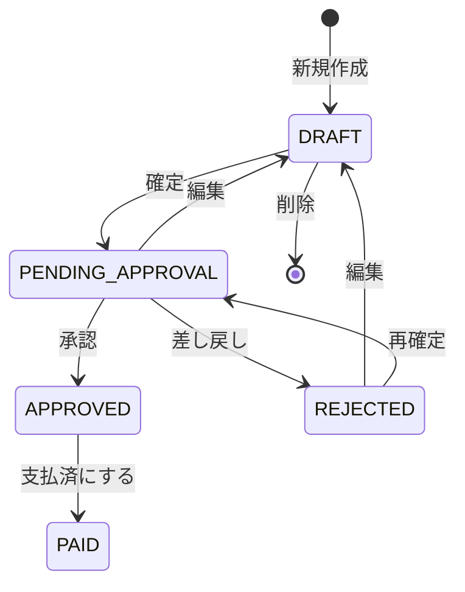

# 05. ビジネスロジック設計

## 5.1 金額計算ロジック

### 5.1.0 小数点処理ルール

**基本方針**

金額計算において小数点以下が発生する場合、以下のルールで処理します。

| 計算項目 | 処理方法 | 関数 | 理由 |
|---------|---------|------|------|
| 明細行の金額 | **四捨五入** | `Math.round()` | 一般的な商習慣 |
| 税抜金額の逆算 | **四捨五入** | `Math.round()` | 一般的な商習慣 |
| 小計（税別） | **四捨五入** | `Math.round()` | 明細の合計 |
| 源泉税対象小計 | **四捨五入** | `Math.round()` | 明細の合計 |
| 合計（税込） | **四捨五入** | `Math.round()` | 一般的な商習慣 |
| 源泉所得税 | **切り捨て** | `Math.floor()` | 法令で規定 |
| 請求額 | **計算結果そのまま** | - | 合計 - 源泉税 |

**注意事項**

- JavaScriptの`Math.round()`は四捨五入を行います
- 源泉所得税のみ`Math.floor()`で切り捨てます（所得税法の規定）
- 請求額は整数同士の減算なので小数点は発生しません

---

### 5.1.1 明細行の金額計算

**重要**: 明細行の「金額」は**常に税別金額**として計算・保存・表示されます。

**基本計算式**

```typescript
amount = Math.round(unitPrice × quantity × (commissionRate / 100))
```

**計算タイミング**

| ユーザーの操作 | 明細の金額（税別） | 集計 | タイミング |
|-------------|----------------|------|----------|
| 単価を入力 | ✅ 再計算 | ✅ 再計算 | リアルタイム（onChange） |
| 個数を変更 | ✅ 再計算 | ✅ 再計算 | リアルタイム（onChange） |
| 報酬率を変更 | ✅ 再計算 | ✅ 再計算 | リアルタイム（onChange） |
| 消費税「込/別」変更 | ❌ 変わらない | ✅ 再計算 | リアルタイム（onChange） |
| 税率を変更 | ❌ 変わらない | ✅ 再計算 | リアルタイム（onChange） |
| 源泉税対象チェック | ❌ 変わらない | ✅ 再計算 | リアルタイム（onChange） |

**ポイント**
- 明細の金額（税別）は、単価・個数・報酬率の変更時のみ再計算
- 消費税設定や税率を変更しても、明細の金額（税別）は変わらない
- 税込金額は集計セクションの「合計（税込）」で表示
- 全ての計算はフロントエンドでリアルタイムに実行（onChange）

**特殊ケース**

1. **報酬率100%の場合**
   ```typescript
   amount = Math.round(unitPrice × quantity)
   ```

2. **報酬率0%の場合（固定金額）**
   ```typescript
   amount = unitPrice
   // quantityは1固定または入力不要
   ```

**計算例**

| 単価 | 個数 | 報酬率 | 金額 |
|------|------|--------|------|
| 100,000 | 1 | 100.0% | 100,000 |
| 100,000 | 2 | 100.0% | 200,000 |
| 100,000 | 1 | 50.0% | 50,000 |
| 100,000 | 2 | 50.0% | 100,000 |
| 100,000 | - | 0% | 100,000 |

**実装コード例**

```typescript
function calculateItemAmount(
  unitPrice: number,
  quantity: number,
  commissionRate: number
): number {
  if (commissionRate === 0) {
    return unitPrice;
  }
  // 小数点以下を四捨五入
  return Math.round(unitPrice * quantity * (commissionRate / 100));
}
```

---

### 5.1.2 小計（税別）の計算

**計算方法**

全明細の「税抜金額」を合計する。

- **消費税「別」の明細**: 金額をそのまま税抜金額として集計
- **消費税「込」の明細**: 金額から税率を使って税抜金額を逆算してから集計

**税抜金額の逆算式（消費税「込」の場合）**

```typescript
taxExclusiveAmount = Math.round(amount / (1 + taxRate / 100))
```

**計算例**

| 明細 | 金額 | 消費税 | 税率 | 税抜金額 |
|------|------|--------|------|---------|
| 1 | 100,000 | 別 | 10% | 100,000 |
| 2 | 110,000 | 込 | 10% | 100,000 |
| 3 | 50,000 | 別 | 10% | 50,000 |

**小計（税別）** = 100,000 + 100,000 + 50,000 = **250,000**

**実装コード例**

```typescript
function calculateSubtotal(items: InvoiceItem[]): number {
  const total = items.reduce((sum, item) => {
    let taxExclusiveAmount: number;
    
    if (item.taxType === 'EXCLUSIVE') {
      // 税別: 金額をそのまま使用
      taxExclusiveAmount = item.amount;
    } else {
      // 税込: 税抜金額を逆算（四捨五入）
      taxExclusiveAmount = Math.round(item.amount / (1 + item.taxRate / 100));
    }
    
    return sum + taxExclusiveAmount;
  }, 0);
  
  // 合計も四捨五入
  return Math.round(total);
}
```

---

### 5.1.3 源泉税対象小計（税別）の計算

**計算方法**

明細のうち「源泉税対象＝対象」の行だけを集計した税抜金額の合計。

**計算例**

| 明細 | 金額 | 消費税 | 税率 | 源泉税対象 | 税抜金額 |
|------|------|--------|------|-----------|---------|
| 1 | 100,000 | 別 | 10% | ○ | 100,000 |
| 2 | 110,000 | 込 | 10% | ○ | 100,000 |
| 3 | 50,000 | 別 | 10% | × | 50,000 |

**源泉税対象小計（税別）** = 100,000 + 100,000 = **200,000**

**実装コード例**

```typescript
function calculateWithholdingTaxSubtotal(items: InvoiceItem[]): number {
  const total = items
    .filter(item => item.withholdingTaxTarget)
    .reduce((sum, item) => {
      let taxExclusiveAmount: number;
      
      if (item.taxType === 'EXCLUSIVE') {
        taxExclusiveAmount = item.amount;
      } else {
        // 税抜金額を逆算（四捨五入）
        taxExclusiveAmount = Math.round(item.amount / (1 + item.taxRate / 100));
      }
      
      return sum + taxExclusiveAmount;
    }, 0);
  
  // 合計も四捨五入
  return Math.round(total);
}
```

---

### 5.1.4 合計（税込）の計算

**計算方法**

各明細ごとに税込金額を計算し、全明細分を合計する。

- **消費税「別」**: 税抜金額 × (1 + 消費税率 / 100)
- **消費税「込」**: 金額をそのまま税込として扱う

**計算例**

| 明細 | 金額 | 消費税 | 税率 | 税込金額 |
|------|------|--------|------|---------|
| 1 | 100,000 | 別 | 10% | 110,000 |
| 2 | 110,000 | 込 | 10% | 110,000 |
| 3 | 50,000 | 別 | 10% | 55,000 |

**合計（税込）** = 110,000 + 110,000 + 55,000 = **275,000**

**実装コード例**

```typescript
function calculateTotalWithTax(items: InvoiceItem[]): number {
  const total = items.reduce((sum, item) => {
    let taxInclusiveAmount: number;
    
    if (item.taxType === 'EXCLUSIVE') {
      // 税別: 税込金額を計算（四捨五入）
      taxInclusiveAmount = Math.round(item.amount * (1 + item.taxRate / 100));
    } else {
      // 税込: 金額をそのまま使用
      taxInclusiveAmount = item.amount;
    }
    
    return sum + taxInclusiveAmount;
  }, 0);
  
  // 合計も四捨五入
  return Math.round(total);
}
```

---

### 5.1.5 源泉所得税の計算

**計算方法**

```typescript
withholdingTax = Math.floor(withholdingTaxSubtotal × 0.1021)
```

- 源泉税対象小計（税別） × 10.21%
- **1円未満切り捨て**（Math.floor）

**税率の根拠**

- 個人への報酬・料金の標準的な源泉徴収率: **10.21%**
- 内訳: 所得税10% + 復興特別所得税0.21%（所得税の2.1%）

**計算例**

| 源泉税対象小計（税別） | 源泉所得税 |
|---------------------|-----------|
| 100,000 | Math.floor(100,000 × 0.1021) = **10,210** |
| 200,000 | Math.floor(200,000 × 0.1021) = **20,420** |
| 99,999 | Math.floor(99,999 × 0.1021) = **10,209** |

**実装コード例**

```typescript
function calculateWithholdingTax(withholdingTaxSubtotal: number): number {
  const WITHHOLDING_TAX_RATE = 0.1021; // 10.21%
  return Math.floor(withholdingTaxSubtotal * WITHHOLDING_TAX_RATE);
}
```

**注意事項（MVP外）**

- 100万円超の報酬の場合、税率が異なる（20.42%）
- MVP版では100万円超の請求はシステム外で個別計算する運用とする

---

### 5.1.6 請求額（税込）の計算

**計算方法**

```typescript
invoiceAmount = totalWithTax - withholdingTax
```

**計算例**

| 合計（税込） | 源泉所得税 | 請求額（税込） |
|------------|-----------|--------------|
| 275,000 | 20,420 | **254,580** |
| 110,000 | 10,210 | **99,790** |

**実装コード例**

```typescript
function calculateInvoiceAmount(
  totalWithTax: number,
  withholdingTax: number
): number {
  return totalWithTax - withholdingTax;
}
```

---

### 5.1.7 完全な計算フロー

**実装コード例**

```typescript
interface InvoiceItem {
  amount: number;
  taxType: 'INCLUSIVE' | 'EXCLUSIVE';
  taxRate: number;
  withholdingTaxTarget: boolean;
}

interface InvoiceCalculation {
  subtotal: number;
  withholdingTaxSubtotal: number;
  totalWithTax: number;
  withholdingTax: number;
  invoiceAmount: number;
}

function calculateInvoice(items: InvoiceItem[]): InvoiceCalculation {
  // 1. 小計（税別）
  const subtotal = calculateSubtotal(items);
  
  // 2. 源泉税対象小計（税別）
  const withholdingTaxSubtotal = calculateWithholdingTaxSubtotal(items);
  
  // 3. 合計（税込）
  const totalWithTax = calculateTotalWithTax(items);
  
  // 4. 源泉所得税
  const withholdingTax = calculateWithholdingTax(withholdingTaxSubtotal);
  
  // 5. 請求額（税込）
  const invoiceAmount = calculateInvoiceAmount(totalWithTax, withholdingTax);
  
  return {
    subtotal,
    withholdingTaxSubtotal,
    totalWithTax,
    withholdingTax,
    invoiceAmount
  };
}
```

---

### 5.1.8 エッジケース

**ケース1: 源泉税対象の明細がない場合**

```typescript
// 源泉税対象小計 = 0
// 源泉所得税 = 0
// 請求額 = 合計（税込）
```

**ケース2: 全明細が税込の場合**

```typescript
// 小計（税別）は逆算で計算
// 合計（税込）は金額の合計
```

**ケース3: 報酬率が小数点の場合**

```typescript
// 例: 単価100,000、個数1、報酬率50.5%
// 金額 = 100,000 × 1 × 0.505 = 50,500
```

**ケース4: 小数点以下が発生する場合**

```typescript
// 例1: 報酬率が小数点の場合
// 単価100,000、個数1、報酬率50.5%
// 金額 = Math.round(100,000 × 1 × 0.505) = Math.round(50,500) = 50,500

// 例2: 税抜金額の逆算で割り切れない場合
// 金額110,001円（税込）、税率10%
// 税抜金額 = Math.round(110,001 / 1.10) = Math.round(100,000.909...) = 100,001

// 例3: 源泉所得税の計算
// 源泉税対象小計99,999円
// 源泉所得税 = Math.floor(99,999 × 0.1021) = Math.floor(10,209.8979) = 10,209
```

**重要**: 源泉所得税のみ`Math.floor()`で切り捨て、他の金額計算は全て`Math.round()`で四捨五入

---

## 5.2 請求書番号の採番ロジック

### 5.2.1 採番ルール

**形式**: `YYYYMM-XXXX`

- **YYYYMM**: 請求締日の年月（例: 202411）
- **XXXX**: 月ごとの連番（4桁、0埋め、例: 0001）

**例**

- 2024年11月30日締め → `202411-0001`
- 2024年11月30日締め（2件目） → `202411-0002`
- 2024年12月31日締め → `202412-0001`（連番リセット）

---

### 5.2.2 採番タイミング

**タイミング**: 自社側で「確定」ボタンを押した時（ステータス: DRAFT → PENDING_APPROVAL）

**注意事項**

- 下書き中に請求締日を変更した場合、確定時の請求締日に基づいて番号が採番される
- 一度採番された請求書番号は変更不可

---

### 5.2.3 同時実行時の排他制御

**問題**

複数ユーザーが同時に同じ月の請求書を確定すると、連番が重複する可能性がある。

**解決策: データベーストランザクション + ロック**

```typescript
async function generateInvoiceNumber(billingDate: Date): Promise<string> {
  const yearMonth = format(billingDate, 'yyyyMM'); // 例: "202411"
  
  // トランザクション開始
  return await prisma.$transaction(async (tx) => {
    // 同じ年月の最大連番を取得（行ロック）
    const lastInvoice = await tx.invoice.findFirst({
      where: {
        invoiceNumber: {
          startsWith: yearMonth
        }
      },
      orderBy: {
        invoiceNumber: 'desc'
      },
      // PostgreSQLの行ロック（FOR UPDATE）
      // Prismaでは暗黙的にトランザクション内で排他制御される
    });
    
    let nextSequence = 1;
    
    if (lastInvoice && lastInvoice.invoiceNumber) {
      // 既存の連番を抽出して+1
      const lastSequence = parseInt(lastInvoice.invoiceNumber.split('-')[1]);
      nextSequence = lastSequence + 1;
    }
    
    // 請求書番号を生成
    const invoiceNumber = `${yearMonth}-${String(nextSequence).padStart(4, '0')}`;
    
    return invoiceNumber;
  });
}
```

**ポイント**

- トランザクション内で最大連番を取得
- Prismaのトランザクションにより、同時実行時も連番が重複しない
- PostgreSQLの`SELECT FOR UPDATE`相当の動作

---

### 5.2.4 採番エラーハンドリング

**エラーケース**

1. **連番が9999を超える場合**
   - エラーメッセージ: 「この月の請求書番号が上限に達しました」
   - 対応: 手動で番号を調整（MVP外）

2. **請求締日が未来の場合**
   - エラーメッセージ: 「請求締日は過去または当日の日付を指定してください」

---

## 5.3 ステータス遷移ロジック

### 5.3.1 ステータス一覧

| ステータス | 値 | 説明 |
|-----------|---|------|
| 下書き | DRAFT | 作成中 |
| 承認待ち | PENDING_APPROVAL | 自社側で確定済み、フリーランスの承認待ち |
| 差し戻し | REJECTED | フリーランスが差し戻し |
| 承認済 | APPROVED | フリーランスが承認 |
| 支払済 | PAID | 自社側で支払完了 |

---

### 5.3.2 ステータス遷移図



---

### 5.3.3 遷移条件と処理

#### DRAFT → PENDING_APPROVAL（確定）

**実行者**: 自社ユーザー

**条件**
- 明細が1行以上存在
- 全フィールドのバリデーションが通過

**処理**
1. 請求書番号を採番
2. 自社情報・フリーランス情報をスナップショット保存
3. ステータスを「PENDING_APPROVAL」に変更
4. `confirmedAt`に現在日時を設定
5. InvoiceStatusHistoryに履歴追加
6. 連絡文テンプレート生成

**実装コード例**

```typescript
async function confirmInvoice(invoiceId: string, userId: string) {
  return await prisma.$transaction(async (tx) => {
    // 請求書取得
    const invoice = await tx.invoice.findUnique({
      where: { id: invoiceId },
      include: { freelancer: true }
    });
    
    if (!invoice) throw new Error('請求書が見つかりません');
    if (invoice.status !== 'DRAFT') throw new Error('下書きのみ確定できます');
    
    // 請求書番号採番
    const invoiceNumber = await generateInvoiceNumber(invoice.billingDate);
    
    // 自社情報・フリーランス情報取得
    const company = await tx.companyInfo.findFirst();
    const freelancer = invoice.freelancer;
    
    // スナップショット作成
    const companySnapshot = JSON.stringify({
      companyName: company.companyName,
      address: company.address,
      phone: company.phone,
      // ...
    });
    
    const freelancerSnapshot = JSON.stringify({
      name: freelancer.name,
      address: freelancer.address,
      phone: freelancer.phone,
      invoiceNumber: freelancer.invoiceNumber,
      // ...
    });
    
    // 請求書更新
    const updatedInvoice = await tx.invoice.update({
      where: { id: invoiceId },
      data: {
        invoiceNumber,
        status: 'PENDING_APPROVAL',
        companySnapshot,
        freelancerSnapshot,
        confirmedAt: new Date()
      }
    });
    
    // ステータス履歴追加
    await tx.invoiceStatusHistory.create({
      data: {
        invoiceId,
        fromStatus: 'DRAFT',
        toStatus: 'PENDING_APPROVAL',
        changedBy: userId
      }
    });
    
    // 監査ログ追加
    await tx.auditLog.create({
      data: {
        userId,
        invoiceId,
        action: 'INVOICE_CONFIRM',
        details: JSON.stringify({ invoiceNumber })
      }
    });
    
    return updatedInvoice;
  });
}
```

---

#### PENDING_APPROVAL → APPROVED（承認）

**実行者**: フリーランス

**条件**
- ログインユーザーが該当フリーランス本人

**処理**
1. ステータスを「APPROVED」に変更
2. InvoiceStatusHistoryに履歴追加

---

#### PENDING_APPROVAL → REJECTED（差し戻し）

**実行者**: フリーランス

**条件**
- ログインユーザーが該当フリーランス本人
- コメント入力必須

**処理**
1. ステータスを「REJECTED」に変更
2. InvoiceStatusHistoryに履歴追加（コメント含む）

---

#### PENDING_APPROVAL → DRAFT（編集）

**実行者**: 自社ユーザー

**条件**
- 承認待ち中の請求書を編集

**処理**
1. ステータスを「DRAFT」に戻す
2. 請求書番号をクリア（再確定時に再採番）
3. InvoiceStatusHistoryに履歴追加

---

#### REJECTED → DRAFT（編集）

**実行者**: 自社ユーザー

**条件**
- 差し戻された請求書を編集

**処理**
1. ステータスを「DRAFT」に変更（既にDRAFT扱い）
2. 編集内容を保存

---

#### REJECTED → PENDING_APPROVAL（再確定）

**実行者**: 自社ユーザー

**条件**
- 差し戻された請求書を修正後、再確定

**処理**
- DRAFT → PENDING_APPROVALと同様

---

#### APPROVED → PAID（支払済にする）

**実行者**: 自社ユーザー

**条件**
- 実支払日入力必須

**処理**
1. ステータスを「PAID」に変更
2. `paymentDate`に実支払日を設定
3. InvoiceStatusHistory に履歴追加

---

#### DRAFT → 削除

**実行者**: 自社ユーザー

**条件**
- ステータスが「DRAFT」のみ

**処理**
1. 請求書を物理削除
2. 関連する InvoiceItem, InvoiceStatusHistory も CASCADE削除

---

### 5.3.4 編集制限

| ステータス | 編集可否 | 削除可否 | 備考 |
|-----------|---------|---------|------|
| DRAFT | ○ | ○ | 自由に編集・削除可能 |
| PENDING_APPROVAL | ○ | × | 編集するとDRAFTに戻る |
| REJECTED | ○ | × | 編集可能 |
| APPROVED | × | × | 編集・削除不可 |
| PAID | × | × | 編集・削除不可 |

---

## 5.4 スナップショット保存ロジック

### 5.4.1 保存タイミング

**タイミング**: 請求書確定時（DRAFT → PENDING_APPROVAL）

**保存対象**
- 自社情報（CompanyInfo）
- フリーランス情報（Freelancer）

---

### 5.4.2 保存形式

**形式**: JSON文字列

**自社情報スナップショット例**

```json
{
  "companyName": "株式会社サンプル",
  "postalCode": "1234567",
  "address": "東京都渋谷区...",
  "phone": "03-1234-5678",
  "email": "info@example.com",
  "additionalInfo": "その他情報"
}
```

**フリーランス情報スナップショット例**

```json
{
  "name": "山田太郎",
  "nameKana": "ヤマダタロウ",
  "postalCode": "1234567",
  "address": "神奈川県横浜市...",
  "phone": "090-1234-5678",
  "email": "yamada@example.com",
  "invoiceNumber": "T1234567890123",
  "bankName": "○○銀行",
  "bankBranch": "△△支店",
  "accountType": "ORDINARY",
  "accountNumber": "1234567",
  "accountHolder": "ヤマダタロウ"
}
```

---

### 5.4.3 スナップショットの利用

**利用場面**
- PDF生成時
- 請求書詳細表示時

**注意事項**
- 確定後に自社情報やフリーランス情報が変更されても、過去の請求書はスナップショット時点の情報で表示・出力される
- データ整合性を保つため、スナップショットは変更不可

---

## 5.5 日付計算ロジック

### 5.5.1 請求締日のデフォルト値

**ルール**: 起票した前月末

**計算例**

| 起票日 | 請求締日（デフォルト） |
|--------|---------------------|
| 2024-12-15 | 2024-11-30 |
| 2024-12-01 | 2024-11-30 |
| 2024-12-31 | 2024-11-30 |
| 2025-01-05 | 2024-12-31 |

**実装コード例**

```typescript
import { endOfMonth, subMonths } from 'date-fns';

function getDefaultBillingDate(): Date {
  const today = new Date();
  const lastMonth = subMonths(today, 1);
  return endOfMonth(lastMonth);
}
```

---

### 5.5.2 支払予定日のデフォルト値

**ルール**: 締日の翌月末

**計算例**

| 請求締日 | 支払予定日（デフォルト） |
|---------|---------------------|
| 2024-11-30 | 2024-12-31 |
| 2024-12-31 | 2025-01-31 |
| 2024-02-29 | 2024-03-31 |

**実装コード例**

```typescript
import { endOfMonth, addMonths } from 'date-fns';

function getDefaultPaymentDueDate(billingDate: Date): Date {
  const nextMonth = addMonths(billingDate, 1);
  return endOfMonth(nextMonth);
}
```

---

## 5.6 バリデーションロジック

### 5.6.1 請求書作成時のバリデーション

**必須チェック**

1. フリーランスが選択されている
2. 明細が1行以上存在
3. 各明細の必須項目が入力されている
4. 請求締日 ≤ 支払予定日

**金額チェック**

1. 単価 ≥ 0
2. 個数 ≥ 1
3. 報酬率: 0 ≤ rate ≤ 100
4. 消費税率: 0 ≤ rate ≤ 100
5. 明細の金額 > 0

---

### 5.6.2 フリーランス登録時のバリデーション

**必須チェック**

1. 氏名が入力されている
2. メールアドレスが入力されている
3. メールアドレスが重複していない

**形式チェック**

1. メールアドレスが正しい形式
2. 郵便番号が7桁数字（入力されている場合）
3. 適格請求書発行事業者登録番号が正しい形式（入力されている場合）
   - 形式: `T` + 数字13桁
   - 正規表現: `^T\d{13}$`
   - 例: `T1234567890123`

---

## 次のドキュメント

- [06_セキュリティ・PDF・エラーハンドリング.md](./06_セキュリティ・PDF・エラーハンドリング.md)
