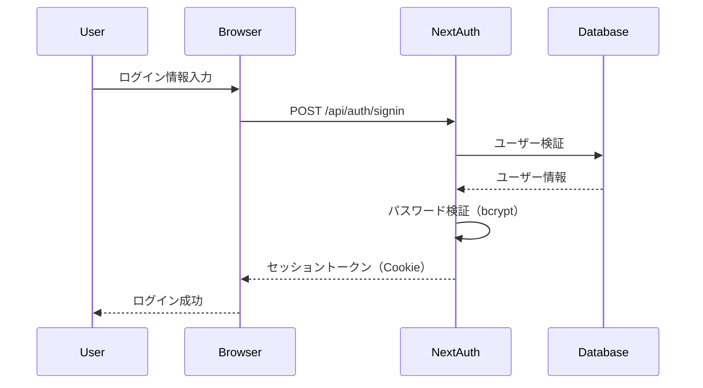

# 06. セキュリティ・PDF生成・エラーハンドリング設計

## 6.1 セキュリティ設計

### 6.1.1 認証・認可

#### 認証方式

**NextAuth.js v5（セッションベース認証）**

- セッショントークンをCookieに保存
- サーバーサイドでセッション検証
- HTTPS必須

**認証フロー**



**設定例（auth.ts）**

```typescript
import NextAuth from "next-auth";
import CredentialsProvider from "next-auth/providers/credentials";
import { PrismaAdapter } from "@auth/prisma-adapter";
import { prisma } from "@/lib/prisma";
import bcrypt from "bcryptjs";

export const { handlers, auth, signIn, signOut } = NextAuth({
  adapter: PrismaAdapter(prisma),
  providers: [
    CredentialsProvider({
      name: "Credentials",
      credentials: {
        username: { label: "Username", type: "text" },
        password: { label: "Password", type: "password" }
      },
      async authorize(credentials) {
        if (!credentials?.username || !credentials?.password) {
          return null;
        }

        const user = await prisma.user.findFirst({
          where: {
            OR: [
              { email: credentials.username },
              { username: credentials.username }
            ]
          }
        });

        if (!user || user.status !== 'ACTIVE') {
          return null;
        }

        const isPasswordValid = await bcrypt.compare(
          credentials.password,
          user.passwordHash
        );

        if (!isPasswordValid) {
          return null;
        }

        return {
          id: user.id,
          email: user.email,
          username: user.username,
          role: user.role
        };
      }
    })
  ],
  session: {
    strategy: "jwt",
    maxAge: 30 * 24 * 60 * 60 // 30日
  },
  pages: {
    signIn: "/login"
  },
  callbacks: {
    async jwt({ token, user }) {
      if (user) {
        token.role = user.role;
        token.id = user.id;
      }
      return token;
    },
    async session({ session, token }) {
      if (session.user) {
        session.user.role = token.role;
        session.user.id = token.id;
      }
      return session;
    }
  }
});
```

---

#### 認可（アクセス制御）

**ミドルウェアによる認証チェック（middleware.ts）**

```typescript
import { NextResponse } from 'next/server';
import type { NextRequest } from 'next/server';
import { auth } from '@/lib/auth';

export async function middleware(request: NextRequest) {
  const session = await auth();
  
  // 未認証の場合、ログイン画面へリダイレクト
  if (!session) {
    return NextResponse.redirect(new URL('/login', request.url));
  }
  
  // ロールベースのアクセス制御
  const path = request.nextUrl.pathname;
  
  if (path.startsWith('/settings') && session.user.role !== 'COMPANY') {
    return NextResponse.redirect(new URL('/mypage', request.url));
  }
  
  if (path.startsWith('/mypage') && session.user.role !== 'FREELANCER') {
    return NextResponse.redirect(new URL('/', request.url));
  }
  
  return NextResponse.next();
}

export const config = {
  matcher: [
    '/((?!api|_next/static|_next/image|favicon.ico|login|reset-password).*)',
  ],
};
```

**APIルートでの認可チェック**

```typescript
import { auth } from '@/lib/auth';
import { NextResponse } from 'next/server';

export async function GET(request: Request) {
  const session = await auth();
  
  if (!session) {
    return NextResponse.json(
      { error: { code: 'UNAUTHORIZED', message: '認証が必要です' } },
      { status: 401 }
    );
  }
  
  if (session.user.role !== 'COMPANY') {
    return NextResponse.json(
      { error: { code: 'FORBIDDEN', message: 'アクセス権限がありません' } },
      { status: 403 }
    );
  }
  
  // 処理続行
}
```

---

### 6.1.2 パスワード管理

#### パスワードハッシュ化

**ライブラリ**: bcryptjs

**コスト係数**: 10（デフォルト）

**実装例**

```typescript
import bcrypt from 'bcryptjs';

// パスワードハッシュ化
async function hashPassword(password: string): Promise<string> {
  const salt = await bcrypt.genSalt(10);
  return await bcrypt.hash(password, salt);
}

// パスワード検証
async function verifyPassword(
  password: string,
  hash: string
): Promise<boolean> {
  return await bcrypt.compare(password, hash);
}
```

---

#### パスワードポリシー

**要件**

- 最小長: 8文字
- 推奨: 英数字記号の組み合わせ

**バリデーション例**

```typescript
function validatePassword(password: string): boolean {
  if (password.length < 8) {
    return false;
  }
  // 追加の複雑性チェック（オプション）
  const hasUpperCase = /[A-Z]/.test(password);
  const hasLowerCase = /[a-z]/.test(password);
  const hasNumber = /[0-9]/.test(password);
  
  return hasUpperCase && hasLowerCase && hasNumber;
}
```

---

### 6.1.3 CSRF対策

**Next.js + NextAuth.jsのビルトイン機能**

- NextAuth.jsが自動的にCSRFトークンを生成・検証
- フォーム送信時にCSRFトークンを含める

**追加対策**

- SameSite Cookie属性を設定（`SameSite=Lax`）

---

### 6.1.4 XSS対策

**Reactの自動エスケープ**

- Reactは自動的にユーザー入力をエスケープ
- `dangerouslySetInnerHTML`は使用しない

**Content Security Policy（CSP）**

```typescript
// next.config.js
const securityHeaders = [
  {
    key: 'Content-Security-Policy',
    value: [
      "default-src 'self'",
      "script-src 'self' 'unsafe-eval' 'unsafe-inline'",
      "style-src 'self' 'unsafe-inline'",
      "img-src 'self' data: https:",
      "font-src 'self' data:",
      "connect-src 'self'"
    ].join('; ')
  }
];

module.exports = {
  async headers() {
    return [
      {
        source: '/:path*',
        headers: securityHeaders
      }
    ];
  }
};
```

---

### 6.1.5 SQLインジェクション対策

**Prisma ORMのパラメータ化クエリ**

- Prismaは自動的にパラメータ化クエリを使用
- 生のSQLクエリは使用しない

**安全な例**

```typescript
// 安全: Prismaのパラメータ化クエリ
const user = await prisma.user.findUnique({
  where: { email: userInput }
});

// 危険: 生のSQLクエリ（使用しない）
// const user = await prisma.$queryRaw`SELECT * FROM User WHERE email = ${userInput}`;
```

---

### 6.1.6 セッション管理

**セッション設定**

- 有効期限: 30日
- アイドルタイムアウト: なし（MVP）
- セッショントークンはHTTPOnly Cookie

**ログアウト**

```typescript
import { signOut } from '@/lib/auth';

async function handleLogout() {
  await signOut({ redirect: true, redirectTo: '/login' });
}
```

---

### 6.1.7 監査ログ

**記録対象**

- ユーザーログイン・ログアウト
- 請求書の作成・更新・削除
- ステータス変更
- 重要な設定変更

**実装例**

```typescript
async function createAuditLog(
  userId: string,
  action: string,
  details: object,
  invoiceId?: string
) {
  await prisma.auditLog.create({
    data: {
      userId,
      invoiceId,
      action,
      details: JSON.stringify(details),
      ipAddress: request.headers.get('x-forwarded-for') || 'unknown'
    }
  });
}
```

---

## 6.2 PDF生成設計

### 6.2.1 使用ライブラリ

**推奨**: @react-pdf/renderer

**理由**

- Reactコンポーネントとして記述可能
- Next.jsとの親和性が高い
- 日本語フォント対応

**代替案**: PDFKit（より低レベルな制御が必要な場合）

---

### 6.2.2 テンプレート設計

**レイアウト構成**

```
┌─────────────────────────────────────┐
│ 請求書                               │
│                                     │
│ 請求書番号: 202411-0001              │
│ 請求日: 2024年11月30日               │
├─────────────────────────────────────┤
│ 【発注者】                           │
│ 株式会社サンプル                     │
│ 〒123-4567                          │
│ 東京都渋谷区...                      │
│ TEL: 03-1234-5678                   │
├─────────────────────────────────────┤
│ 【受注者】                           │
│ 山田太郎 様                          │
│ 〒123-4567                          │
│ 神奈川県横浜市...                    │
│ TEL: 090-1234-5678                  │
│ 適格請求書発行事業者登録番号: T1234567890123 │
├─────────────────────────────────────┤
│ 【振込先情報】                       │
│ 銀行名: ○○銀行                      │
│ 支店名: △△支店                      │
│ 口座種別: 普通                       │
│ 口座番号: 1234567                    │
│ 口座名義: ヤマダタロウ               │
├─────────────────────────────────────┤
│ 【明細】                             │
│ ┌──┬────┬──┬──┬────┬────┐ │
│ │品名│単価  │数│率│消費税│金額  │ │
│ ├──┼────┼──┼──┼────┼────┤ │
│ │Web│100,000│1│100│別10%│100,000│ │
│ └──┴────┴──┴──┴────┴────┘ │
├─────────────────────────────────────┤
│ 小計（税別）:           100,000円    │
│ 内、源泉税対象小計（税別）: 100,000円│
│ 合計（税込）:           110,000円    │
│ 源泉所得税:              10,210円    │
│ ━━━━━━━━━━━━━━━━━━━━━━━━━━━━ │
│ 請求額（税込）:          99,790円    │
├─────────────────────────────────────┤
│ 【備考】                             │
│ よろしくお願いいたします。           │
└─────────────────────────────────────┘
```

---

### 6.2.3 実装例

```typescript
import React from 'react';
import {
  Document,
  Page,
  Text,
  View,
  StyleSheet,
  Font
} from '@react-pdf/renderer';

// 日本語フォント登録
Font.register({
  family: 'NotoSansJP',
  src: '/fonts/NotoSansJP-Regular.ttf'
});

const styles = StyleSheet.create({
  page: {
    fontFamily: 'NotoSansJP',
    fontSize: 10,
    padding: 30
  },
  header: {
    fontSize: 20,
    marginBottom: 20,
    textAlign: 'center'
  },
  section: {
    marginBottom: 10,
    padding: 10,
    border: '1px solid #000'
  },
  table: {
    display: 'table',
    width: 'auto',
    marginBottom: 10
  },
  tableRow: {
    flexDirection: 'row'
  },
  tableCell: {
    border: '1px solid #000',
    padding: 5
  },
  total: {
    fontSize: 14,
    fontWeight: 'bold',
    textAlign: 'right',
    marginTop: 10
  }
});

interface InvoicePDFProps {
  invoice: Invoice;
}

const InvoicePDF: React.FC<InvoicePDFProps> = ({ invoice }) => (
  <Document>
    <Page size="A4" style={styles.page}>
      {/* ヘッダー */}
      <Text style={styles.header}>請求書</Text>
      
      <View style={styles.section}>
        <Text>請求書番号: {invoice.invoiceNumber}</Text>
        <Text>請求日: {formatDate(invoice.billingDate)}</Text>
      </View>
      
      {/* 発注者情報 */}
      <View style={styles.section}>
        <Text>【発注者】</Text>
        <Text>{invoice.companySnapshot.companyName}</Text>
        <Text>〒{invoice.companySnapshot.postalCode}</Text>
        <Text>{invoice.companySnapshot.address}</Text>
        <Text>TEL: {invoice.companySnapshot.phone}</Text>
      </View>
      
      {/* 受注者情報 */}
      <View style={styles.section}>
        <Text>【受注者】</Text>
        <Text>{invoice.freelancerSnapshot.name} 様</Text>
        <Text>〒{invoice.freelancerSnapshot.postalCode}</Text>
        <Text>{invoice.freelancerSnapshot.address}</Text>
        <Text>TEL: {invoice.freelancerSnapshot.phone}</Text>
        {invoice.freelancerSnapshot.invoiceNumber && (
          <Text>適格請求書発行事業者登録番号: {invoice.freelancerSnapshot.invoiceNumber}</Text>
        )}
      </View>
      
      {/* 振込先情報 */}
      <View style={styles.section}>
        <Text>【振込先情報】</Text>
        <Text>銀行名: {invoice.freelancerSnapshot.bankName}</Text>
        <Text>支店名: {invoice.freelancerSnapshot.bankBranch}</Text>
        <Text>口座種別: {invoice.freelancerSnapshot.accountType === 'ORDINARY' ? '普通' : invoice.freelancerSnapshot.accountType === 'CURRENT' ? '当座' : '貯蓄'}</Text>
        <Text>口座番号: {invoice.freelancerSnapshot.accountNumber}</Text>
        <Text>口座名義: {invoice.freelancerSnapshot.accountHolder}</Text>
      </View>
      
      {/* 明細テーブル */}
      <View style={styles.section}>
        <Text>【明細】</Text>
        <View style={styles.table}>
          {/* ヘッダー行 */}
          <View style={styles.tableRow}>
            <Text style={[styles.tableCell, { width: '30%' }]}>品名</Text>
            <Text style={[styles.tableCell, { width: '15%' }]}>単価</Text>
            <Text style={[styles.tableCell, { width: '10%' }]}>数量</Text>
            <Text style={[styles.tableCell, { width: '10%' }]}>率(%)</Text>
            <Text style={[styles.tableCell, { width: '15%' }]}>消費税</Text>
            <Text style={[styles.tableCell, { width: '20%' }]}>金額</Text>
          </View>
          
          {/* 明細行 */}
          {invoice.items.map((item) => (
            <View key={item.id} style={styles.tableRow}>
              <Text style={[styles.tableCell, { width: '30%' }]}>{item.productName}</Text>
              <Text style={[styles.tableCell, { width: '15%' }]}>{formatCurrency(item.unitPrice)}</Text>
              <Text style={[styles.tableCell, { width: '10%' }]}>{item.quantity}</Text>
              <Text style={[styles.tableCell, { width: '10%' }]}>{item.commissionRate}</Text>
              <Text style={[styles.tableCell, { width: '15%' }]}>
                {item.taxType === 'INCLUSIVE' ? '込' : '別'}{item.taxRate}%
              </Text>
              <Text style={[styles.tableCell, { width: '20%' }]}>{formatCurrency(item.amount)}</Text>
            </View>
          ))}
        </View>
      </View>
      
      {/* 集計 */}
      <View style={styles.section}>
        <Text>小計（税別）: {formatCurrency(invoice.subtotal)}円</Text>
        <Text>内、源泉税対象小計（税別）: {formatCurrency(invoice.withholdingTaxSubtotal)}円</Text>
        <Text>合計（税込）: {formatCurrency(invoice.totalWithTax)}円</Text>
        <Text>源泉所得税: {formatCurrency(invoice.withholdingTax)}円</Text>
        <Text style={styles.total}>請求額（税込）: {formatCurrency(invoice.invoiceAmount)}円</Text>
      </View>
      
      {/* 備考 */}
      {invoice.notes && (
        <View style={styles.section}>
          <Text>【備考】</Text>
          <Text>{invoice.notes}</Text>
        </View>
      )}
    </Page>
  </Document>
);

export default InvoicePDF;
```

---

### 6.2.4 PDF生成API

```typescript
import { NextResponse } from 'next/server';
import { renderToStream } from '@react-pdf/renderer';
import InvoicePDF from '@/components/pdf/InvoicePDF';
import { auth } from '@/lib/auth';
import { prisma } from '@/lib/prisma';

export async function GET(
  request: Request,
  { params }: { params: { id: string } }
) {
  const session = await auth();
  
  if (!session) {
    return NextResponse.json({ error: 'Unauthorized' }, { status: 401 });
  }
  
  // 請求書取得
  const invoice = await prisma.invoice.findUnique({
    where: { id: params.id },
    include: { items: true }
  });
  
  if (!invoice) {
    return NextResponse.json({ error: 'Not found' }, { status: 404 });
  }
  
  // アクセス権限チェック
  if (session.user.role === 'FREELANCER') {
    const freelancer = await prisma.freelancer.findFirst({
      where: { userId: session.user.id }
    });
    
    if (invoice.freelancerId !== freelancer?.id) {
      return NextResponse.json({ error: 'Forbidden' }, { status: 403 });
    }
  }
  
  // PDF生成
  const stream = await renderToStream(<InvoicePDF invoice={invoice} />);
  
  return new NextResponse(stream as any, {
    headers: {
      'Content-Type': 'application/pdf',
      'Content-Disposition': `attachment; filename="invoice_${invoice.invoiceNumber}.pdf"`
    }
  });
}
```

---

### 6.2.5 日本語フォント対応

**フォントファイル配置**

```
public/
  fonts/
    NotoSansJP-Regular.ttf
    NotoSansJP-Bold.ttf
```

**ダウンロード元**: Google Fonts（Noto Sans JP）

---

## 6.3 エラーハンドリング

### 6.3.1 エラーの種類

| エラー種別 | HTTPステータス | 説明 |
|-----------|--------------|------|
| バリデーションエラー | 400 | 入力値が不正 |
| 認証エラー | 401 | 未認証 |
| 権限エラー | 403 | アクセス権限なし |
| リソース未検出 | 404 | データが見つからない |
| ビジネスロジックエラー | 422 | 業務ルール違反 |
| サーバーエラー | 500 | 予期しないエラー |

---

### 6.3.2 エラーレスポンス形式

**統一フォーマット**

```json
{
  "error": {
    "code": "ERROR_CODE",
    "message": "ユーザー向けエラーメッセージ",
    "details": {
      "field1": "フィールド固有のエラー",
      "field2": "フィールド固有のエラー"
    }
  }
}
```

---

### 6.3.3 エラーハンドリング実装

**APIルートでのエラーハンドリング**

```typescript
import { NextResponse } from 'next/server';
import { ZodError } from 'zod';

export async function POST(request: Request) {
  try {
    // 処理
    const data = await request.json();
    
    // バリデーション
    const validated = schema.parse(data);
    
    // ビジネスロジック
    const result = await createInvoice(validated);
    
    return NextResponse.json({ invoice: result }, { status: 201 });
    
  } catch (error) {
    // Zodバリデーションエラー
    if (error instanceof ZodError) {
      return NextResponse.json(
        {
          error: {
            code: 'VALIDATION_ERROR',
            message: '入力内容に誤りがあります',
            details: error.flatten().fieldErrors
          }
        },
        { status: 400 }
      );
    }
    
    // ビジネスロジックエラー
    if (error instanceof BusinessError) {
      return NextResponse.json(
        {
          error: {
            code: error.code,
            message: error.message
          }
        },
        { status: 422 }
      );
    }
    
    // その他のエラー
    console.error('Unexpected error:', error);
    return NextResponse.json(
      {
        error: {
          code: 'INTERNAL_SERVER_ERROR',
          message: 'サーバーエラーが発生しました'
        }
      },
      { status: 500 }
    );
  }
}
```

---

### 6.3.4 ビジネスロジックエラー

**カスタムエラークラス**

```typescript
export class BusinessError extends Error {
  constructor(
    public code: string,
    message: string
  ) {
    super(message);
    this.name = 'BusinessError';
  }
}

// 使用例
if (invoice.status !== 'DRAFT') {
  throw new BusinessError(
    'CANNOT_EDIT',
    '承認済・支払済の請求書は編集できません'
  );
}
```

---

### 6.3.5 ログ出力方針

**ログレベル**

- **ERROR**: システムエラー、予期しないエラー
- **WARN**: ビジネスロジックエラー、バリデーションエラー
- **INFO**: 重要な操作（請求書確定、承認など）
- **DEBUG**: デバッグ情報（開発環境のみ）

**実装例**

```typescript
// 簡易ロガー
const logger = {
  error: (message: string, error?: any) => {
    console.error(`[ERROR] ${message}`, error);
  },
  warn: (message: string, data?: any) => {
    console.warn(`[WARN] ${message}`, data);
  },
  info: (message: string, data?: any) => {
    console.log(`[INFO] ${message}`, data);
  },
  debug: (message: string, data?: any) => {
    if (process.env.NODE_ENV === 'development') {
      console.log(`[DEBUG] ${message}`, data);
    }
  }
};

// 使用例
logger.info('Invoice confirmed', { invoiceId, invoiceNumber });
logger.error('Failed to generate PDF', error);
```

---

### 6.3.6 フロントエンドでのエラー表示

**トースト通知**

```typescript
import { toast } from 'react-hot-toast';

async function handleSubmit() {
  try {
    const response = await fetch('/api/invoices', {
      method: 'POST',
      body: JSON.stringify(data)
    });
    
    if (!response.ok) {
      const error = await response.json();
      toast.error(error.error.message);
      return;
    }
    
    toast.success('請求書を作成しました');
  } catch (error) {
    toast.error('エラーが発生しました');
  }
}
```

**フォームバリデーションエラー**

```typescript
// React Hook Formでのエラー表示
<input {...register('email', { required: 'メールアドレスは必須です' })} />
{errors.email && <span className="error">{errors.email.message}</span>}
```

---

## 次のドキュメント

- [07_デプロイ設計・開発計画.md](./07_デプロイ設計・開発計画.md)
